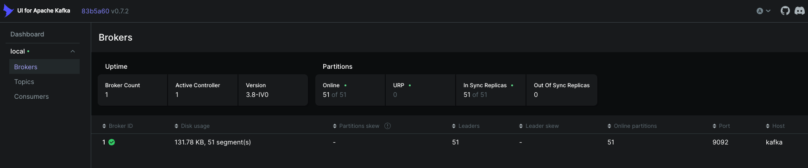
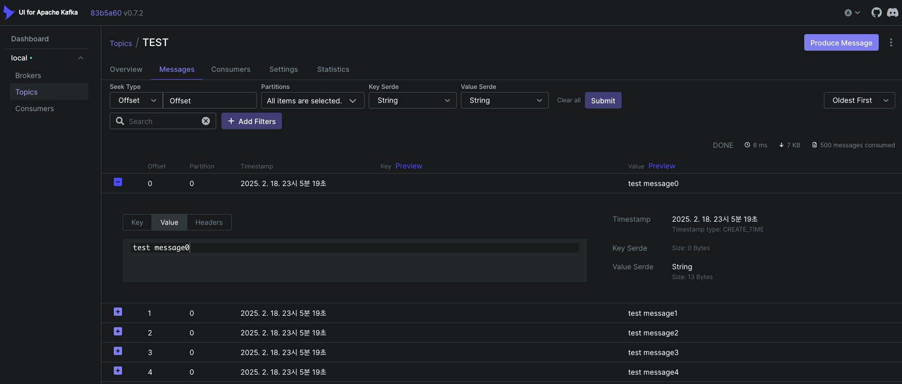
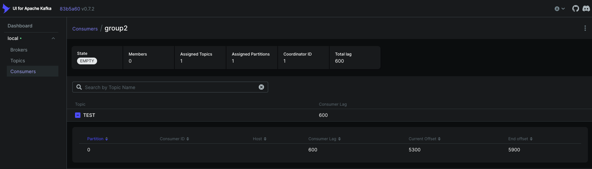

# Kafka Producer, Consumer 연동

## docker-compose 설정

```yaml
version: '3.8'
services:

  zookeeper:
    image: confluentinc/cp-zookeeper:7.8.1
    container_name: hh-zookeeper
    ports:
      - "12181:12181"
    environment:
      ZOOKEEPER_SERVER_ID: 1
      ZOOKEEPER_CLIENT_PORT: 2181
      ZOOKEEPER_TICK_TIME: 2000
      ZOOKEEPER_INIT_LIMIT: 5
      ZOOKEEPER_SYNC_LIMIT: 2

  kafka:
    image: confluentinc/cp-kafka:7.8.1
    container_name: hh-kafka
    depends_on:
      - zookeeper
    ports:
      - "19092:19092"
    environment:
      KAFKA_BROKER_ID: 1
      KAFKA_ZOOKEEPER_CONNECT: 'zookeeper:2181'
      KAFKA_ADVERTISED_LISTENERS: PLAINTEXT://kafka:9092,PLAINTEXT_HOST://localhost:19092
      KAFKA_LISTENER_SECURITY_PROTOCOL_MAP: PLAINTEXT:PLAINTEXT,PLAINTEXT_HOST:PLAINTEXT
      KAFKA_INTER_BROKER_LISTENER_NAME: PLAINTEXT
      KAFKA_OFFSETS_TOPIC_REPLICATION_FACTOR: 1
      KAFKA_GROUP_INITIAL_REBALANCE_DELAY_MS: 0

  kafka-ui:
    image: provectuslabs/kafka-ui
    container_name: hh-kafka-ui
    depends_on:
      - kafka
    ports:
      - "8989:8080"
    environment:
      - KAFKA_CLUSTERS_0_NAME=local
      - KAFKA_CLUSTERS_0_BOOTSTRAPSERVERS=kafka:9092
      - KAFKA_CLUSTERS_0_ZOOKEEPER=zookeeper:2181

```

## Producer 설정

```java
@EnableKafka
@Configuration
public class KafkaProducerConfiguration {

    @Value("${spring.kafka.producer.bootstrap-servers}")
    private String producerBootstrapServers;

    @Bean
    public Map<String, Object> producerConfigs() {
        Map<String, Object> props = new HashMap<>();
        props.put(ProducerConfig.BOOTSTRAP_SERVERS_CONFIG, producerBootstrapServers);
        props.put(ProducerConfig.KEY_SERIALIZER_CLASS_CONFIG, StringSerializer.class);
        props.put(ProducerConfig.VALUE_SERIALIZER_CLASS_CONFIG, StringSerializer.class);
        props.put(ProducerConfig.ACKS_CONFIG, "all");
        return props;
    }

    @Bean
    public ProducerFactory<String, String> producerFactory() {
        return new DefaultKafkaProducerFactory<>(producerConfigs());
    }

    @Bean
    public KafkaTemplate<String, String> kafkaTemplate() {
        return new KafkaTemplate<>(producerFactory());
    }
}
```

## Consumer 설정

```java
@EnableKafka
@Configuration
public class KafkaConsumerConfiguration {

    @Value("${spring.kafka.consumer.bootstrap-servers}")
    private String consumerBootstrapServers;

    @Bean
    public Map<String, Object> consumerConfigs() {
        Map<String, Object> props = new HashMap<>();

        props.put(ConsumerConfig.BOOTSTRAP_SERVERS_CONFIG, consumerBootstrapServers);
        props.put(ConsumerConfig.KEY_DESERIALIZER_CLASS_CONFIG, StringDeserializer.class);
        props.put(ConsumerConfig.VALUE_DESERIALIZER_CLASS_CONFIG, StringDeserializer.class);
        props.put(ConsumerConfig.ENABLE_AUTO_COMMIT_CONFIG, false); // manual commit
        props.put(ConsumerConfig.MAX_POLL_RECORDS_CONFIG, 3000); // read 3000 msg
        props.put(ConsumerConfig.FETCH_MIN_BYTES_CONFIG, 1024 * 1024); // 1mb
        props.put(ConsumerConfig.FETCH_MAX_WAIT_MS_CONFIG, 5 * 1000); // broker waiting time = 5s
        props.put(ConsumerConfig.SESSION_TIMEOUT_MS_CONFIG, 60 * 1000); // session timeout = 1m
        props.put(ConsumerConfig.HEARTBEAT_INTERVAL_MS_CONFIG, 20 * 1000); // heartbeat interval = 20s ( 1/3 of session_timeout )
        props.put(ConsumerConfig.MAX_POLL_INTERVAL_MS_CONFIG, 2 * 60 * 1000); // max poll interval = 2m
        return props;
    }

    @Bean
    public ConsumerFactory<String, String> consumerFactory() {
        return new DefaultKafkaConsumerFactory<>(consumerConfigs());
    }

    @Bean
    public ConcurrentKafkaListenerContainerFactory<String, String> concurrentKafkaListenerContainerFactory() {
        ConcurrentKafkaListenerContainerFactory<String, String> factory =
                new ConcurrentKafkaListenerContainerFactory<>();
        factory.setConsumerFactory(consumerFactory());
        factory.setConcurrency(3);
        factory.getContainerProperties().setAckMode(ContainerProperties.AckMode.MANUAL);
        factory.setBatchListener(true); // 배치 리스너
        return factory;
    }

}
```

## 스크린샷





