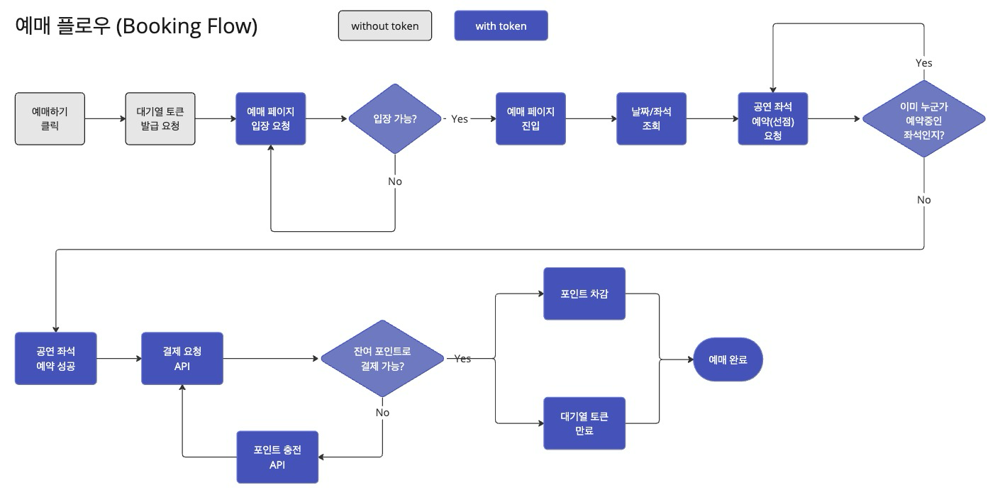
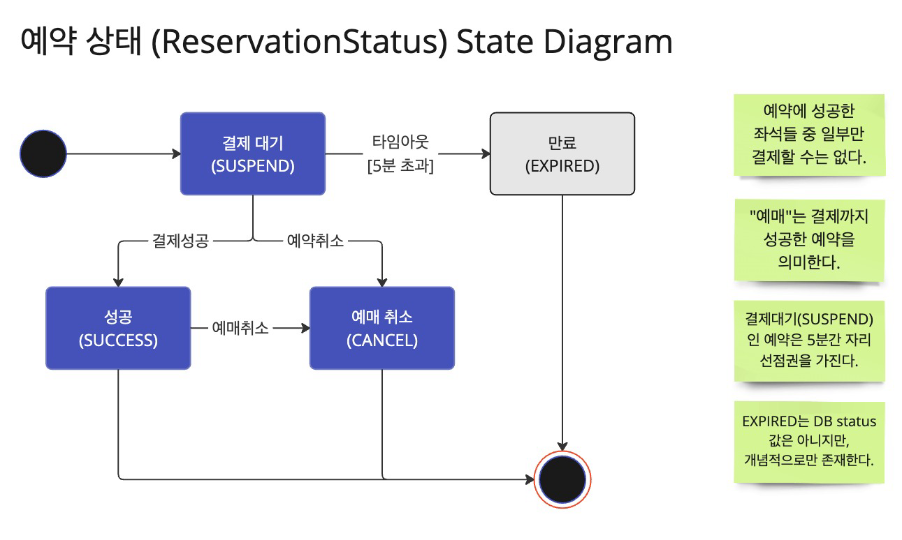

# UML

# 1. Flow Chart

## 예매 흐름도

  

## 예매 유저 흐름도

  

# 2. State Diagram

## 예약 상태 다이어그램

  

### 설명

- 예약 상태 (Reservation Status)
  - 결제 대기 (SUSPEND): 예약 초기 상태
  - 예약 완료 (SUCCESS): 결제까지 완료된 상태
  - 예약 취소 (CANCEL): 예약 단계에서 취소하거나, 예매 완료 이후 취소한 상태
  - 예약 만료 (EXPIRED): 5분 이내 결제가 완료되지 않은 상태
    - DB 상태값을 가지지 않지만, expired_at 필드를 통해 만료된 상태를 확인합니다.
    - 혹은, TTL 정책을 이용해 예약 레코드를 삭제하도록 합니다.

# 3. Class Diagram

## 1. 유저 대기열 토큰 발급

  

### 설명

콘서트 예매 특성상, 순간적으로 높은 트래픽이 발생할 수 있습니다.

빠르게 대기열에 접근하기 위해 RDB 이외에 인메모리 DB인 Redis, Aerospike 등으로 충분히 전환이 가능하다고 판단하였습니다.

따라서, 대기열 큐 도메인에 대해 JPA Repository를 곧바로 사용하지 않고 DIP를 적용하여 인터페이스를 두었습니다.

## 2. 콘서트 좌석 예약 요청

  

### 설명

콘서트 좌석 예약 성공 시, 5분동안 임시 배정을 유지하고 이후에 만료가 됩니다.

TTL 정책 상, 예약 저장소를 RDB 이외에 인메모리 DB인 Redis, Aerospike 등으로 충분히 전환이 가능하다고 판단하였습니다.

따라서, 예약 도메인에 대해 JPA Repository를 곧바로 사용하지 않고 DIP를 적용하여 인터페이스를 두었습니다.

## 3. 포인트 잔액 충전/조회

  

### 설명

포인트 잔액 충전 방식을 여러 모듈을 이용하여 충전할 수 있도록 설계하였습니다. (ex. 카카오페이, 네이버페이, 이체 등)

`UserPoint` 서비스 로직이 커짐에 따라, 포인트 충전을 별도의 서비스로 분리하였습니다.

따라서, `UserPoint` 도메인의 경우 충전/조회/사용 으로 서비스를 아예 분리시켰습니다.

## 4. 콘서트 좌석 결제

  

### 설명

콘서트 좌석 결제 시, `포인트 차감`, `예약 상태 변경`, `대기열 토큰 만료` 세 가지 작업이 이뤄져야 합니다.

따라서, `PaymentFacade` 레이어를 추가로 두어 이 세 가지 작업을 묶어 처리하도록 설계하였습니다.

## 5. 대기열 스케줄러

  

### 설명

대기열 스케줄러는 1초마다 100개의 토큰(100명)을 참가열로 이동시킵니다. (내부적으로 상태 업데이트 `WAITING -> ENTERED`로 구현합니다.)

단, 참가열 최대크기인 1,000개보다 적게 이동시켜야 합니다. 참가열의 크기는 `결제 대기(SUSPEND)`중인 사용자의 수를 기준으로 합니다.

- `WAITING`: 토큰 발급 후 대기열에 들어간 상태 (초기 상태)
- `ENTERED`: 대기열에서 빠져나와 예약 가능한 상태 (예약 가능 상태)

# 4. Sequence Diagram

원본 링크: [시퀀스 다이어그램](https://drive.google.com/file/d/1IH1HSBezoGBOSaWsgjdwsolf6CpFlYlR/view?usp=sharing)

## 1. 콘서트 예매페이지 참가 Flow

  

## 2. 콘서트 좌석 예약 Flow

  

## 3. 콘서트 좌석 결제 Flow

  

