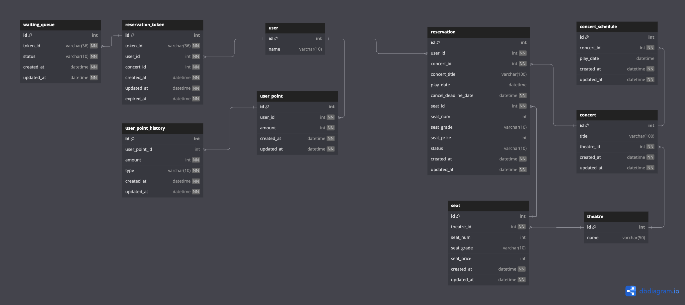

# ERD

원본 링크: [ERD dbdiagram](https://dbdiagram.io/d/concert_booking-6776c9285406798ef72146b2)

### 설명

- `reservation_token` 은 콘서트 단위로 관리되는 서비스 토큰입니다. 따라서 콘서트 스케쥴(`concert_schedule_id`)과 관련이 없도록 분리하였습니다.
- `user`와 `theatre`는 프로젝트에서는 DB로 관리하지 않고, id만 있으면 존재하는 것으로 간주합니다. 개념적으로 존재하면 좋을 것 같아 추가하였습니다.
