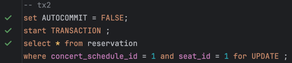

# 보고서 - 로깅 활용과 동시성 이슈 해결 방안에 대하여

# 1. AccessLog 로깅 기능

`예약`과 `결제` API의 모든 요청에 대해 AccessLog를 남기는 기능을 추가해야 한다.

## 1.1. 요구사항

- 로깅 대상 엔드포인트: `예약`과 `결제` API의 모든 요청에 대해 로깅을 수행해야 한다.
- 로깅 필수 값: AccessLog는 Http 요청의 헤더 값(ex. User-Agent, IP, Referer 등)과 소요 시간을 기록해야 한다. 
- 파일 분리: 예약은 `reservation.log`, 결제는 `payment.log` 라는 파일명으로 각각 기록해야 한다.
- 추가 가능: 이후, `포인트 충전` API에 대해서도 로깅이 필요할 수 있으므로, 이에 대한 확장성을 고려해야 한다.
- 비동기 로깅: 로깅은 비동기로 처리되어야 한다.

## 1.2. 방법

## 1) Filter

Http 헤더나 소요 시간에 대해서는 `Filter`가 매우 적합하다고 판단했지만, `예약`과 `결제` API 요청만 따로 로깅을 남기기 위해서는 `Filter`를 사용하기에는 한계가 있다.

모든 요청에 대해 남기는 로깅이라면 `Filter`를 사용하는 것이 가장 적합하다고 판단했지만, 특정 API에 대해서만 로깅을 남기기 위해서는 Spring의 기능이 필요한 `Interceptor`나 `AOP`를 사용해야 한다고 판단했다.

## 2) Interceptor

`Interceptor`는 `WebMvcConfigurer` 인터페이스를 구현한 WebConfiguration 설정 파일에서 path를 자유롭게 지정할 수 있어 `Filter`보다 더 유연하게 사용할 수 있다.

하지만 엔드포인트 관리를 Config 파일에서 관리하기 때문에, 관련 Controller에 메소드가 추가될 때마다 Config 파일을 매번 확인해야 하는 번거로움이 있다.

따라서 `Interceptor`는 로그인과 같이 잘 바뀌지 않는 특정 URL 패턴에 대해 처리해야 할 때 사용하는 것이 적합하다고 판단했다.

## 3) AOP (채택)

`AOP`는 `Filter`와 `Interceptor`보다 더 유연하게 비즈니스 관점에서 사용할 수 있다.

`AOP`는 `Pointcut`을 사용하여 대상을 지정해줄 수 있고, 특히 커스텀 어노테이션을 사용하여 특정 메소드에 대해서만 로깅을 남기는 것이 매우 편리하다.

따라서 `AOP`를 사용하여 `@LogMapping` 이라는 어노테이션을 만들어 `예약`과 `결제` 컨트롤러 메소드에 대해서만 로깅을 남기는 것이 가장 적합하다고 판단했다.

이후, `포인트` 관련 로깅이 추가되어도 `@LogMapping` 어노테이션만 추가해주면 되기 때문에 확장성이 좋다고 판단했다.

### 비동기 로깅

성능을 위해 비동기로 로그를 비동기 스레드를 사용하여 처리하였다.


# 2. 예약 동시성 이슈 DB Lock

## 2-1. `Reservation` 테이블에 대한 동시성 이슈 해결

`Reservation`의 (concertScheduleId, seatId)에 해당하는 예약 row에 대해 조회해보고, 예약중이거나 예약완료인 row가 없다면 insert하는 로직으로 동시성 이슈를 해결했다.

```java
@Repository
public interface ReservationJpaRepository extends JpaRepository<Reservation, Long> {

    @Lock(LockModeType.PESSIMISTIC_WRITE)
    @Query("SELECT r FROM Reservation r WHERE r.concertScheduleId = :concertScheduleId AND r.seatId IN :seatIds")
    List<Reservation> findByConcertScheduleIdAndSeatIdsWithLock(
            @Param("concertScheduleId") long concertScheduleId,
            @Param("seatIds") List<Long> seatIds
    );
}
```

```java
// ReservationService.java
@Transactional
public List<ReservationInfo> createReservations(ReservationCreateCommand command) {
    LocalDateTime now = command.getNow();
    long concertScheduleId = command.getConcertScheduleId();
    List<ReservationCreateCommand.SeatCreateCommand> seats = command.getSeats();
    List<Long> seatIds = seats.stream().map(ReservationCreateCommand.SeatCreateCommand::getSeatId).toList();

    // 1. 예약된 좌석이 없는지 확인한다.
    boolean isReserved = reservationRepository.findByConcertScheduleIdAndSeatIdsWithLock(concertScheduleId, seatIds)
            .stream()
            // 예약완료 혹은 결제대기 중인 예약이 하나라도 있는지 확인
            .anyMatch(reservation -> reservation.isReserved() || (reservation.isSuspend(now)));
    if (isReserved) {
        throw new IllegalArgumentException("이미 예약중인 좌석입니다.");
    }

    // 2. 모든 좌석에 대해 예약을 생성한다.
    List<Reservation> reservations = createReservations(command, seats);
    List<Reservation> savedReservations = reservationRepository.saveAll(reservations);
    return savedReservations.stream()
            .map(ReservationInfo::ofEntity)
            .toList();
}
```

따라서, 동시에 3명이 같은 좌석을 예약 시도할 때 1명만 성공하고, 나머지 2명은 `"이미 예약중인 좌석입니다."` 실패 메시지를 받게 된다.

## 2-2. 데드락 발생

`Reservation` 테이블에 대한 동시성 이슈를 해결하기 위해 `select for update` Lock을 사용하였지만, 데드락이 발생할 수 있다.

- 배경: 동시성 테스트에서 DB cleanUp 후, Reservation row를 삽입하려고 할 때 데드락 발생
- 재현: MariaDB에서도 동일하게 발생하는지 확인
  - 트랜잭션 (tx1, tx2, tx3) 3개에 대해 `select for update`로 동시에 잠금을 잡은 후, `insert`를 시도하면 데드락 발생하는지 확인해본다.
- 결론: gap lock은 X-lock이어도 공유가 가능하므로 데드락이 발생할 수 있다.

### 1) Reservation row가 없을 때

만약 인덱스의 레코드를 단 하나도 스캔하지 못한다면 Phantom Read를 방지하기 위해 gap lock을 걸게 된다.

gap lock의 주목적은 데이터 inserting을 방지하는 것이기 때문에 서로 공유가 가능합니다. (출처: [MySQL 공식문서](https://dev.mysql.com/doc/refman/8.4/en/innodb-locking.html#innodb-gap-locks))

1. `tx1`에서 `select for update` 실행
  - 
  - Lock 획득 성공
2. `tx2`와 `tx3`에서 `select for update` 실행
   - 
   - 
   - 모두 Lock 획득 성공 (gap lock은 공유 가능하기 때문)
3. `tx1`에서 insert를 시도한다.
   - 이때, `tx1`은 Lock 대기상태에 빠진다. `tx2`와 `tx3`이 gap lock을 잡고 있기 때문이다.
   - ```text
     +------+---------+-------------------+---------------------+-------------------+----------+-------------------+-------------------------------------------------------------------------------------------------------------------------------------------------------------------------------------------------------+-------------------+-----------------+-----------------+----------------+---------------------+---------------+-----------------+-----------------------+-------------------+-----------------+----------------------+--------------------------+----------------+--------------------------+
     |trx_id|trx_state|trx_started        |trx_requested_lock_id|trx_wait_started   |trx_weight|trx_mysql_thread_id|trx_query                                                                                                                                                                                              |trx_operation_state|trx_tables_in_use|trx_tables_locked|trx_lock_structs|trx_lock_memory_bytes|trx_rows_locked|trx_rows_modified|trx_concurrency_tickets|trx_isolation_level|trx_unique_checks|trx_foreign_key_checks|trx_last_foreign_key_error|trx_is_read_only|trx_autocommit_non_locking|
     +------+---------+-------------------+---------------------+-------------------+----------+-------------------+-------------------------------------------------------------------------------------------------------------------------------------------------------------------------------------------------------+-------------------+-----------------+-----------------+----------------+---------------------+---------------+-----------------+-----------------------+-------------------+-----------------+----------------------+--------------------------+----------------+--------------------------+
     |981   |RUNNING  |2025-01-16 15:35:21|null                 |null               |2         |96                 |null                                                                                                                                                                                                   |                   |0                |1                |2               |1128                 |1              |0                |0                      |REPEATABLE READ    |1                |1                     |null                      |0               |0                         |
     |980   |RUNNING  |2025-01-16 15:35:18|null                 |null               |2         |95                 |null                                                                                                                                                                                                   |                   |0                |1                |2               |1128                 |1              |0                |0                      |REPEATABLE READ    |1                |1                     |null                      |0               |0                         |
     |979   |LOCK WAIT|2025-01-16 15:35:16|979:52:3:1           |2025-01-16 15:35:24|3         |94                 |insert into reservation (concert_schedule_id, concert_id, seat_id,  user_id, status, cancel_deadline_date, expired_at)                                                                                 |inserting          |1                |1                |3               |1128                 |2              |0                |0                      |REPEATABLE READ    |1                |1                     |null                      |0               |0                         |
     |      |         |                   |                     |                   |          |                   |values (1, 1, 1, 1, 'SUSPEND', '2024-01-19 00:00:00', '2024-01-19 00:00:00')                                                                                                                           |                   |                 |                 |                |                     |               |                 |                       |                   |                 |                      |                          |                |                          |
     +------+---------+-------------------+---------------------+-------------------+----------+-------------------+-------------------------------------------------------------------------------------------------------------------------------------------------------------------------------------------------------+-------------------+-----------------+-----------------+----------------+---------------------+---------------+-----------------+-----------------------+-------------------+-----------------+----------------------+--------------------------+----------------+--------------------------+
     ```
   - `supremum pseudo-record`은 가장 큰 값 이후의 모든 간격을 잠그는 잠금이다. (Next Key Lock이라고도 하며, gap lock의 일종이다.)
   - ```text
     +----------+-----------+---------+---------+-----------------------+----------+----------+---------+--------+----------------------+
     |lock_id   |lock_trx_id|lock_mode|lock_type|lock_table             |lock_index|lock_space|lock_page|lock_rec|lock_data             |
     +----------+-----------+---------+---------+-----------------------+----------+----------+---------+--------+----------------------+
     |979:52:3:1|924        |X        |RECORD   |`concert`.`reservation`|PRIMARY   |52        |3        |1       |supremum pseudo-record|
     +----------+-----------+---------+---------+-----------------------+----------+----------+---------+--------+----------------------+
     ```
4. `tx2`와 `tx3`에서 insert를 시도하면 deadlock 발생
   - tx1이 insert를 기다리고 있는 도중에, tx2와 tx3이 insert를 시도하면 deadlock이 발생한다.
   - 동시에, tx1은 tx2와 tx3의 gap lock을 기다리고 있기 때문에 데드락이 발생한다.
   - ```text
     [40001][1213] (conn=84) Deadlock found when trying to get lock; try restarting transaction
     ```

### 2) Reservation row가 있을 때

id=3인 row가 이미 존재한다.

1. `tx1`에서 `select for update` 실행
   - 
   - Lock 획득 성공
2. `tx2`와 `tx3`에서 `select for update` 실행
   - 
   - 
   - Lock 대기
   - ```text
     +----------+-----------+---------+---------+-----------------------+----------+----------+---------+--------+---------+
     |lock_id   |lock_trx_id|lock_mode|lock_type|lock_table             |lock_index|lock_space|lock_page|lock_rec|lock_data|
     +----------+-----------+---------+---------+-----------------------+----------+----------+---------+--------+---------+
     |943:53:3:2|943        |X        |RECORD   |`concert`.`reservation`|PRIMARY   |53        |3        |2       |3        |
     |941:53:3:2|941        |X        |RECORD   |`concert`.`reservation`|PRIMARY   |53        |3        |2       |3        |
     |942:53:3:2|942        |X        |RECORD   |`concert`.`reservation`|PRIMARY   |53        |3        |2       |3        |
     +----------+-----------+---------+---------+-----------------------+----------+----------+---------+--------+---------+
     ```
   - 아까와 달리, 명확히 lock_data(id=3)인 row에 대한 X-lock을 잡고 있기 때문에 데드락이 발생하지 않는다.
   - 인덱스를 걸지 않으면 PK 인덱스를 스캔하기 때문

## 2-3. 데드락 해결 방안

### 1) 인덱스를 걸지 않고, 테이블에 row 삽입

프로덕션 환경에서는 테이블이 비어 있을 확률은 거의 없기 때문에 이 부분은 크게 문제될 부분은 아니다.

하지만, 인덱스를 걸 수 없기 때문에 테이블이 커질 경우 성능 이슈가 발생할 수 있다.

### 2) 인덱스를 걸고, INSERT IGNORE 쿼리 사용

중복된 PK 혹은 unique에 대해 삽입하려고 할 때, 해당 insert 쿼리를 무시하고 에러도 발생시키지 않는 쿼리이다.

(concertSchduleId, seatId)에 대해 unique index를 걸어두고, `INSERT IGNORE` 쿼리를 사용하면 데드락이 발생하지 않는다.

따라서, 조회를 생략하고 데이터 존재 유무와 상관없이 매번 INSERT IGNORE를 사용하면 순서도 보장되고 데드락도 발생하지 않는다.

#### unique 제약 조건

```java
@Table(name = "reservation", uniqueConstraints = {
        @UniqueConstraint(name = "uk_reservation_concert_schedule_id_seat_id", columnNames = {"concert_schedule_id", "seat_id"})
})
public class Reservation {
    //...
}
```

#### INSERT IGNORE 쿼리

```java
@Modifying(clearAutomatically = true)
@Query(value = "INSERT IGNORE INTO reservation " +
      "(user_id, concert_id, concert_title, concert_schedule_id, play_date, cancel_deadline_date, seat_id, seat_num, seat_grade, seat_price, status, expired_at) " +
      "VALUES (:#{#reservation.userId}, :#{#reservation.concertId}, :#{#reservation.concertTitle}, :#{#reservation.concertScheduleId}, :#{#reservation.playDate}, :#{#reservation.cancelDeadlineDate}, :#{#reservation.seatId}, :#{#reservation.seatNum}, :#{#reservation.seatGrade}, :#{#reservation.seatPrice}, :#{#reservation.status}, :#{#reservation.expiredAt})",
      nativeQuery = true)
int insertIgnore(@Param("reservation") Reservation reservation);
```

#### 변경된 코드

조회하는 로직이 사라져 코드도 짧아졌다.

```java
@Transactional
public List<ReservationInfo> createReservations(ReservationCreateCommand command) {
    List<ReservationCreateCommand.SeatCreateCommand> seats = command.getSeats();
    
    // 모든 좌석에 대해 예약을 시도한다.
    List<Reservation> reservations = createReservations(command, seats);
    for (Reservation reservation : reservations) {
        int result = reservationRepository.insertIgnore(reservation);
        if (result <= 0) {
            throw new IllegalArgumentException("이미 예약중인 좌석입니다.");
        }
    }
    return reservations.stream()
            .map(ReservationInfo::ofEntity)
            .toList();
}
```

원하는대로 테스트도 성공하는 걸 확인할 수 있다.


### 그럼에도 INSERT IGNORE를 채택하지 않은 이유

1. 예약 취소가 있기 때문에, unique index를 걸어두면 예약 취소 후 다시 예약할 때 문제가 발생할 수 있다.
   - unique로 해결할 수 없는 비즈니스 문제이다.
2. JPA native query 사용
   - DB 종속적이고, 결과 매핑을 수동으로 처리해줘야 한다.
   - 가독성이 매우 떨어진다.


## 2-4. 추가: `Seat`의 상태로 Lock을 관리하지 않은 이유

`Seat`은 극장에 있는 좌석 개념이므로, `Seat`의 상태를 통해 동시성 이슈를 관리하면 오로지 한 콘서트에 대해서만 동시성 이슈를 해결할 수 있다.

여러 콘서트와 콘서트 일정에 대해서도 예매 시스템이 가능해야 한다고 가정했기 때문에, `Reservation` 예약 테이블에서 동시성 이슈를 관리하는 것이 좀더 현실적인 방법이라고 판단했다.


# 참고
- [동시성 문제(데드락) 해결기 블로그](https://velog.io/@nak-honest/%EB%8F%99%EC%8B%9C%EC%84%B1-%EB%AC%B8%EC%A0%9C%EB%8D%B0%EB%93%9C%EB%9D%BD-%ED%95%B4%EA%B2%B0%EA%B8%B0-X-%EB%9D%BD%EC%9D%B8%EB%8D%B0-%EC%99%9C-%EA%B3%B5%EC%9C%A0%EA%B0%80-%EA%B0%80%EB%8A%A5%ED%95%98%EC%A7%80)
- [Gap Lock의 실행 원리 탐구 블로그](https://sechoi.tistory.com/23)
- [MySQL 공식문서#InnoDB Locking](https://dev.mysql.com/doc/refman/8.4/en/innodb-locking.html)