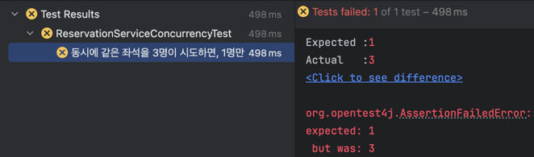
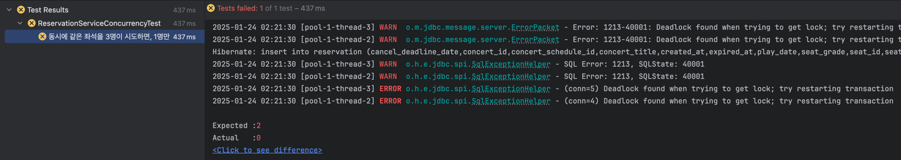
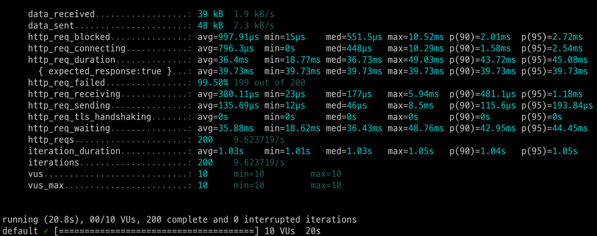
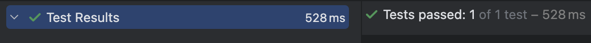

# 동시성 이슈 보고서 - 공연 예매시 발생 가능한 문제와 해결 방안

## 0. 개요

공연 예매 대기열 시스템에서의 핵심 기능인 좌석 예약에서의 발생할 수 있는 동시성 문제를 살펴보고, 현시스템에서의 최적의 해결 방안을 제시한다.

## 1. 공연 예매 시나리오

공연 예매은 다음과 같은 순서로 진행된다.

1. 관람할 공연 선택
2. 관람일/시간 선택
3. 좌석 선택 (한번에 여러 좌석도 가능)
4. 결제
5. 예약 완료

Step 2~4 는 별도의 티켓예매 페이지에서 진행되고, 유저에게는 별도의 대기열 토큰이 발급된다.

- 참고: 대기열 토큰은 공연마다 발급되므로, 해당 토큰으로 다른 공연을 예매할 수 없다.

## 2. 동시성 이슈

`Step3`인 좌석 선택 단계에서 동시성 문제가 발생할 수 있다.

좌석 선택 단계에서는 공연시간(`concertSchedule`) 까지 선택된 상태이므로, 편의상 공연시간은 고정되어 있다고 가정한다.

만약 여러 사용자가 동시에 같은 좌석을 예약할 경우, 예약이 중복되어 좌석이 중복 예약되는 문제가 발생할 수 있다.

따라서, 단 한명만 해당 좌석을 예약할 수 있도록 제어가 필요하다.

## 3. 동시성 문제 발생

### 3.1. 중복 예약 방지 로직

- `(스케쥴ID, 좌석ID)`에 대해 예약중이거나 예약완료인 `Reservation` 테이블 레코드를 조회한다.
  - 조회 결과가 없다면, 해당 좌석을 예약한다. (`INSERT INTO reservation ...`)
  - 조회 결과가 있다면, 이미 예약된 좌석이므로 예약에 실패한다.

위와 같은 로직을 통해 중복 예약을 방지할 수 있다고 생각했다.

### 3.2. 문제점

하지만, 위 로직은 동시성 문제를 완벽하게 해결하지 못한다.

만약 두 사용자가 동시에 같은 좌석을 예약한다면, 두 사용자는 동시에 `Reservation` 테이블 레코드가 없다고 판단하기 때문에 두 사용자 모두 예약에 성공할 수 있다.

#### 구현 코드

```java
@Transactional
public List<ReservationInfo> createReservations(ReservationCreateCommand command) {
    LocalDateTime now = command.getNow();
    long concertScheduleId = command.getConcertScheduleId();
    List<ReservationCreateCommand.SeatCreateCommand> seats = command.getSeats();
    List<Long> seatIds = seats.stream().map(ReservationCreateCommand.SeatCreateCommand::getSeatId).toList();

    // 1. 예약된 좌석이 없는지 확인한다.
    boolean isReserved = reservationRepository.findByConcertScheduleIdAndSeatIds(concertScheduleId, seatIds)
            .stream()
            // 예약완료 혹은 예약중인 예약이 하나라도 있는지 확인
            .anyMatch(reservation -> reservation.isReserved() || (reservation.isSuspend(now)));
    if (isReserved) {
        throw new IllegalArgumentException("이미 예약중인 좌석입니다.");
    }

    // 2. 모든 좌석에 대해 예약을 생성한다.
    List<Reservation> reservations = createReservations(command, seats);
    List<Reservation> savedReservations = reservationRepository.saveAll(reservations);
    return savedReservations.stream()
            .map(ReservationInfo::ofEntity)
            .toList();
}
```

#### 테스트 코드

```java
@DisplayName("동시에 같은 좌석을 3명이 시도하면, 1명만 성공하고 2명은 실패해야 한다.")
@Test
void createReservationsConcurrently() throws Exception {
    // given
    Concert concert = concertRepository.save(createConcert());
    ConcertSchedule concertSchedule = concertScheduleRepository.save(createConcertSchedule(concert.getId()));
    Seat seat1 = seatRepository.save(createSeat(1, Seat.Grade.VIP, 170_000));
    Seat seat2 = seatRepository.save(createSeat(2, Seat.Grade.VIP, 170_000));

    long concertId = concert.getId();
    long concertScheduleId = concertSchedule.getId();
    LocalDateTime now = LocalDateTime.of(2025, 1, 9, 1, 0);
    LocalDateTime playDateTime = LocalDateTime.of(2025, 1, 20, 17, 0);

    List<ReservationCreateCommand.SeatCreateCommand> seatCreateCommands = List.of(
            new ReservationCreateCommand.SeatCreateCommand(seat1.getId(), seat1.getSeatNum(), seat1.getSeatGrade(), seat1.getSeatPrice()),
            new ReservationCreateCommand.SeatCreateCommand(seat2.getId(), seat1.getSeatNum(), seat2.getSeatGrade(), seat2.getSeatPrice())
    );
    ReservationCreateCommand createCommandUser1 = new ReservationCreateCommand(
            1L, concertId, "지킬앤하이드", concertScheduleId, playDateTime, now,
            seatCreateCommands);
    ReservationCreateCommand createCommandUser2 = new ReservationCreateCommand(
            2L, concertId, "지킬앤하이드", concertScheduleId, playDateTime, now,
            seatCreateCommands);
    ReservationCreateCommand createCommandUser3 = new ReservationCreateCommand(
            3L, concertId, "지킬앤하이드", concertScheduleId, playDateTime, now,
            seatCreateCommands);

    final int numOfExecute = 3;
    ExecutorService executorService = Executors.newFixedThreadPool(10);
    CountDownLatch latch = new CountDownLatch(numOfExecute);
    AtomicInteger successCount = new AtomicInteger(0);
    AtomicInteger failCount = new AtomicInteger(0);

    // when
    List.of(createCommandUser1, createCommandUser2, createCommandUser3).forEach(command -> {
        executorService.submit(() -> {
            try {
                reservationService.createReservations(command);
                successCount.incrementAndGet();
            } catch (Exception e) {
                assertThat(e).isInstanceOf(IllegalArgumentException.class)
                        .hasMessage("이미 예약중인 좌석입니다.");
                failCount.incrementAndGet();
            } finally {
                latch.countDown();
            }
        });
    });
    latch.await();
    executorService.shutdown();

    // then
    assertThat(successCount.get()).isEqualTo(1);
    assertThat(failCount.get()).isEqualTo(2);
}
```

#### 테스트 결과



- 결과: 예상과 다르게 3명 모두 예약에 성공했다.
- 이유: 조회 시점에 예약중이거나 예약완료된 좌석이 아니라고 판단했기 때문에, 모두 예약에 성공한 것이다.

## 4. 해결 방안

### 4.1. DB 비관적 락

- `SELECT ... FOR UPDATE` 쿼리를 사용하여, 조회 시점에 x-lock(배타락)을 걸어 다른 트랜잭션이 해당 레코드에 접근하지 못하도록 한다.
- 장점: 데이터 무결성을 강력하게 보장할 수 있다.
- 단점: 나머지 트랜잭션들은 대기 상태에 빠지게 되어 성능이 저하될 수 있다. 또한, 데드락이 발생할 수 있다.

#### 구현 코드

```java
@Repository
public interface ReservationJpaRepository extends JpaRepository<Reservation, Long> {
    @Lock(LockModeType.PESSIMISTIC_WRITE)
    @Query("SELECT r FROM Reservation r WHERE r.concertScheduleId = :concertScheduleId AND r.seatId IN :seatIds")
    List<Reservation> findByConcertScheduleIdAndSeatIdsWithLock(
            @Param("concertScheduleId") long concertScheduleId,
            @Param("seatIds") List<Long> seatIds
    );
}
```

서비스 코드는 `findByConcertScheduleIdAndSeatIds()` -> `findByConcertScheduleIdAndSeatIdsWithLock()` 변경점 외에는 동일하다.

```java
@Transactional
public List<ReservationInfo> createReservations(ReservationCreateCommand command) {
  LocalDateTime now = command.getNow();
  long concertScheduleId = command.getConcertScheduleId();
  List<ReservationCreateCommand.SeatCreateCommand> seats = command.getSeats();
  List<Long> seatIds = seats.stream().map(ReservationCreateCommand.SeatCreateCommand::getSeatId).toList();

  // 1. 예약된 좌석이 없는지 확인한다.
  boolean isReserved = reservationRepository.findByConcertScheduleIdAndSeatIdsWithLock(concertScheduleId, seatIds)
          .stream()
          // 예약완료 혹은 결제대기 중인 예약이 하나라도 있는지 확인
          .anyMatch(reservation -> reservation.isReserved() || (reservation.isSuspend(now)));
  if (isReserved) {
    throw new IllegalArgumentException("이미 예약중인 좌석입니다.");
  }

  // 2. 모든 좌석에 대해 예약을 생성한다.
  List<Reservation> reservations = createReservations(command, seats);
  List<Reservation> savedReservations = reservationRepository.saveAll(reservations);
  return savedReservations.stream()
          .map(ReservationInfo::ofEntity)
          .toList();
}
```

#### 테스트 결과



- 결과: 예상과 다르게 1명은 예약에 성공했지만, 2명이 예외에 잡히지 않고 데드락에 걸렸다. (MariaDB 10.11 기준)
- 이유
  - 빈 테이블에서 `SELECT ... FOR UPDATE` 쿼리를 하면, 조회되는 레코드가 없기 때문에 `supremum pseudo-record` 라는 락이 걸린다.
    - `supremum pseudo-record`: (마지막 레코드, 무한대)까지의 `gap lock`을 걸어 해당 gap에는 다른 트랜잭션이 INSERT할 수 없게 한다. (팬텀 리드를 방지하기 위해)
  - 결론: `gap lock`은 `x-lock`으로 걸어도 동시에 여러 트랜잭션이 공유해서 락을 걸 수 있다.
- 해결 방안: 빈 테이블에 데이터를 미리 INSERT하여 `supremum pseudo-record`을 방지한다.
  - 데드락 관련 자세한 내용은 [중간 보고서](./5_Report.md) 참고

#### 수정한 테스트

```java
@DisplayName("동시에 같은 좌석을 3명이 시도하면, 1명만 성공하고 2명은 실패해야 한다.")
@Test
void createReservationsConcurrently() throws Exception {
  // given
  Concert concert = concertRepository.save(createConcert());
  ConcertSchedule concertSchedule = concertScheduleRepository.save(createConcertSchedule(concert.getId()));
  Seat seat1 = seatRepository.save(createSeat(1, Seat.Grade.VIP, 170_000));
  Seat seat2 = seatRepository.save(createSeat(2, Seat.Grade.VIP, 170_000));

  // Reservation 데이터 수가 0이면 데드락이 발생하므로 초기 데이터 생성
  reservationJpaRepository.save(Instancio.of(Reservation.class)
          .set(field(Reservation::getId), null)
          .set(field(Reservation::getConcertScheduleId), concertSchedule.getId() + 1000)
          .create());

  long concertId = concert.getId();
  long concertScheduleId = concertSchedule.getId();
  LocalDateTime now = LocalDateTime.of(2025, 1, 9, 1, 0);
  LocalDateTime playDateTime = LocalDateTime.of(2025, 1, 20, 17, 0);

  List<ReservationCreateCommand.SeatCreateCommand> seatCreateCommands = List.of(
          new ReservationCreateCommand.SeatCreateCommand(seat1.getId(), seat1.getSeatNum(), seat1.getSeatGrade(), seat1.getSeatPrice()),
          new ReservationCreateCommand.SeatCreateCommand(seat2.getId(), seat1.getSeatNum(), seat2.getSeatGrade(), seat2.getSeatPrice())
  );
  ReservationCreateCommand createCommandUser1 = new ReservationCreateCommand(
          1L, concertId, "지킬앤하이드", concertScheduleId, playDateTime, now,
          seatCreateCommands);
  ReservationCreateCommand createCommandUser2 = new ReservationCreateCommand(
          2L, concertId, "지킬앤하이드", concertScheduleId, playDateTime, now,
          seatCreateCommands);
  ReservationCreateCommand createCommandUser3 = new ReservationCreateCommand(
          3L, concertId, "지킬앤하이드", concertScheduleId, playDateTime, now,
          seatCreateCommands);

  final int numOfExecute = 3;
  ExecutorService executorService = Executors.newFixedThreadPool(10);
  CountDownLatch latch = new CountDownLatch(numOfExecute);
  AtomicInteger successCount = new AtomicInteger(0);
  AtomicInteger failCount = new AtomicInteger(0);

  // when
  List.of(createCommandUser1, createCommandUser2, createCommandUser3).forEach(command -> {
    executorService.submit(() -> {
      try {
        reservationService.createReservations(command);
        successCount.incrementAndGet();
      } catch (Exception e) {
        assertThat(e).isInstanceOf(IllegalArgumentException.class)
                .hasMessage("이미 예약중인 좌석입니다.");
        failCount.incrementAndGet();
      } finally {
        latch.countDown();
      }
    });
  });
  latch.await();
  executorService.shutdown();

  // then
  assertThat(successCount.get()).isEqualTo(1);
  assertThat(failCount.get()).isEqualTo(2);

}
```

#### 성능 테스트

k6를 통해 동시에 10명이 같은 좌석을 예약하는 테스트를 1초 간격으로 20번 수행하여, 총 200번의 요청을 시도했다.

- 결과: 200번의 요청 중 1번만 성공하고, 199번은 실패하였다. 또한, 우려하던 데드락도 발생하지 않았다.
- 요청 총 시간에 대해 살펴보자. `http_req_duration`
  - `p(90)=43.72ms`: 90%의 요청이 43.72ms 이내에 처리되었다.
  - `p(95)=45.08ms`: 95%의 요청이 45.08ms 이내에 처리되었다.
  - `avg=36.4ms min=18.77ms med=36.73ms max=49.03ms`



#### k6 스크립트

```javascript
import http from 'k6/http';
import { sleep } from 'k6';

export const options = {
  vus: 10, // 가상 유저 수
  duration: '20s', // 테스트 실행 시간
};

export default function () {
  const url = 'http://localhost:8080/api/v1/reservation';
  const payload = JSON.stringify({
    concertId: 1,
    concertScheduleId: 1,
    seatIds: [1, 2],
  });

  const params = {
    headers: {
      'accept': '*/*',
      'X-Concert-Token': 'token', // 미리 해당 토큰을 대기열에 넣어둠
      'Content-Type': 'application/json',
    },
  };

  const response = http.post(url, payload, params);

  console.log(`Response status: ${response.status}`);
  sleep(1); // 요청 사이에 1초 간격을 두도록 설정
}
```

### 4.2 JPA 낙관적 락

공연 중복 예약 방지 로직에 대해 낙관적 락을 적용할 수 없는 상황이다.

중복 예약 방지 로직을 다시 살펴보면,

- `(스케쥴ID, 좌석ID)`에 대해 예약중이거나 예약완료인 `Reservation` 테이블 레코드가 없으면 `INSERT`를 수행한다.
- 즉, 기존 있는 레코드를 `UPDATE`하지 않고, 새로운 레코드를 `INSERT`하는 방식이다. 
 
따라서, 낙관적 락의 versioning을 이용할 수 없어 낙관락으로는 동시성 제어로 적용할 수 없다.

다만, 공연 좌석 예약 시나리오에서는 낙관적 락이 유리하다고 생각한다.

- 좌석 예약과 같이 하나만 성공하고 나머지가 모두 실패해도 괜찮다면, 낙관적 락을 사용하는 것이 적합하다고 생각하는데 사용할 수 없는 상황이라, 개인적으로 아쉬웠다. 
- 재시도 로직을 하지 않아도 되기 때문에, 성능적으로도 유리하고 추가 구현이 필요 없어서 좋다고 생각한다.

### 4.3 Redis 분산락

- DB 락을 사용하지 않고, 별도 Redis 서버를 이용하여 분산락을 구현할 수 있다.
- 장점
  - 서비스별로 별도의 DB를 사용하는 MSA 환경에서도 Lock을 공유해서 사용할 수 있다.
  - DB 락을 사용하지 않아, DB에 부하를 줄일 수 있다.
    - DB 락을 사용하면, 커넥션을 점유한 채로 대기하기 때문에 락으로 인해 커넥션 풀이 부족해질 수 있다.
  - TTL 기능이 있어 데드락이 발생하지 않는다.
- 단점
  - SpinLock 방식을 통해 락을 얻는다면, Redis에 불필요하고 과도한 부하를 줄 수 있다.
    - 보완: Pub/Sub 방식으로 사용하는 것이 무조건 좋다.
  - Redis 캐시와 분산락을 함께 사용할 경우 장애 발생 확률이 높아진다. 캐시 메모리 과다로 인해 장애가 발생해도 분산락을 사용할 수 없게 된다.
    - 보완: 여유가 된다면 캐시 서버와 분산락 서버를 분리하는 것이 좋을 수 있다.
  - lock 구현 때문에 핵심 로직이 오염될 수 있다.
    - 보완: AOP를 사용하여 핵심 로직과 분리하면 된다.
  - 트랜잭션 전파 속성에 대해 잘 고려해야 한다.
- 주의점: `Lock 획득 -> Tx 시작 -> 핵심 로직 -> Tx 종료 -> Lock 해제` 순서를 지켜야 한다.
- `Tx 시작 -> Lock 획득 -> 핵심 로직 -> Lock 해제 -> Tx 종료` 순서라면? 
  - Tx를 먼저 시작했는데 Lock을 획득하지 못하면, 대기하게 되는데 DB 커넥션 리소스를 낭비하게 되고 성능 저하 요인이 될 수 있다. (불필요한 DB 커넥션 점유에 대해서는 비관적 락만 쓰는 것과 유사함)
  - 또한, Lock을 획득하기 전에 다른 트랜잭션이 이미 Lock을 획득했다면, 잘못된 데이터를 읽을 수 있다.

#### 구현 코드

좌석 여러 개를 동시에 예약할 수 있기 때문에, MultiLock 으로 구현했다.

```java
@Aspect
@Component
public class DistributedLockAspect {

    private static final String LOCK_PREFIX = "lock:";

    private final RedissonClient redissonClient;
    private final AopForTransaction aopForTransaction;

    public DistributedLockAspect(RedissonClient redissonClient, AopForTransaction aopForTransaction) {
        this.redissonClient = redissonClient;
        this.aopForTransaction = aopForTransaction;
    }
    
    @Around("@annotation(DistributedMultiLock)")
    public Object multiLock(ProceedingJoinPoint joinPoint) throws Throwable {
        MethodSignature signature = (MethodSignature) joinPoint.getSignature();
        Method method = signature.getMethod();

        DistributedMultiLock distributedMultiLock = method.getAnnotation(DistributedMultiLock.class);

        Object[] dynamicValues = CustomSpringELParser.getDynamicValues(
                signature.getParameterNames(),
                joinPoint.getArgs(),
                distributedMultiLock.keys()
        );
        List<String> lockKeyNames = Arrays.stream(dynamicValues)
                .map(String::valueOf)
                .map(key -> LOCK_PREFIX + distributedMultiLock.keyPrefix() + key)
                .toList();

        RLock multiLock = redissonClient.getMultiLock(
                lockKeyNames.stream()
                        .map(redissonClient::getLock)
                        .toArray(RLock[]::new)
        );

        try {
            boolean acquired = multiLock.tryLock(distributedMultiLock.waitTime(), distributedMultiLock.leaseTime(), distributedMultiLock.timeUnit());
            if (!acquired) {
                return false;
            }
            return aopForTransaction.proceed(joinPoint);
        } finally {
            multiLock.unlock();
        }
    }
}
```

```java
/**
 * AOP에서 트랜잭션을 호출하기 위한 클래스
 */
@Component
public class AopForTransaction {

    @Transactional
    public Object proceed(final ProceedingJoinPoint joinPoint) throws Throwable {
        return joinPoint.proceed();
    }
}
```

파라미터로부터 동적으로 받은 lock key의 SpEL을 통해, 동시에 걸 lockKeys 에 대해 배열로 받아올 수 있다. 

```java
@NoArgsConstructor(access = AccessLevel.PRIVATE)
public class CustomSpringELParser {

    private static final SpelExpressionParser PARSER = new SpelExpressionParser();

    public static Object[] getDynamicValues(String[] parameters, Object[] args, String[] keys) {
        StandardEvaluationContext context = new StandardEvaluationContext();

        for (int i = 0; i < parameters.length; i++) {
            context.setVariable(parameters[i], args[i]);
        }

        return Arrays.stream(keys)
                .map(PARSER::parseExpression)
                .map(expression -> expression.getValue(context, Object.class))
                .filter(Objects::nonNull)
                .flatMap(value -> {
                    if (value instanceof Collection<?> collection) {
                        return collection.stream();
                    }
                    if (value instanceof Object[] array) {
                        return Arrays.stream(array);
                    }
                    return Stream.of(value);
                })
                .toArray();
    }
}
```

```java
@Target(ElementType.METHOD)
@Retention(RetentionPolicy.RUNTIME)
public @interface DistributedMultiLock {

    String[] keys();

    /**
     * 락 Key 에 prefix 를 추가한다
     */
    String keyPrefix() default "";

    TimeUnit timeUnit() default TimeUnit.SECONDS;

    /**
     * 락 획득을 위해 기다리는 시간
     */
    long waitTime() default 5L;

    /**
     * 락 획득 이후, leaseTime 이 지나면 락을 해제한다
     */
    long leaseTime() default 3L;
}
```

아래와 같이 Spring Expression Language(SpEL)을 사용하여, 락 키를 동적으로 전달할 수 있다.

또한, 테스트를 위해 DB 비관적 락은 제거하였다.

#### 서비스 코드

```java
@DistributedMultiLock(keys = {"#command.seats.![ #command.concertScheduleId + ':' + seatId ]"}, keyPrefix = "reservation:")
public List<ReservationInfo> createReservations(ReservationCreateCommand command) {
  LocalDateTime now = command.getNow();
  long concertScheduleId = command.getConcertScheduleId();
  List<ReservationCreateCommand.SeatCreateCommand> seats = command.getSeats();
  List<Long> seatIds = seats.stream().map(ReservationCreateCommand.SeatCreateCommand::getSeatId).toList();

  // 1. 예약된 좌석이 없는지 확인한다.
  boolean isReserved = reservationRepository.findByConcertScheduleIdAndSeatIds(concertScheduleId, seatIds)
          .stream()
          // 예약완료 혹은 결제대기 중인 예약이 하나라도 있는지 확인
          .anyMatch(reservation -> reservation.isReserved() || (reservation.isSuspend(now)));
  if (isReserved) {
    throw new IllegalArgumentException("이미 예약중인 좌석입니다.");
  }

  // 2. 모든 좌석에 대해 예약을 생성한다.
  List<Reservation> reservations = createReservations(command, seats);
  List<Reservation> savedReservations = reservationRepository.saveAll(reservations);
  return savedReservations.stream()
          .map(ReservationInfo::ofEntity)
          .toList();
}
```

#### 테스트 결과



- 결과: 예상과 같이 1명만 성공하고, 2명은 실패했다.
- 이유: Redis 분산락을 사용하여, 다른 트랜잭션들이 임계영역에 대해 동시 접근이 불가능하기 때문이다.

#### 성능 테스트

k6를 통해 동시에 10명이 같은 좌석을 예약하는 테스트를 1초 간격으로 20번 수행하여, 총 200번의 요청을 시도했다.

Facade에서 예약 서비스 이외에는 조회만 하기 때문에 Facade에서는 `@Transactional`를 제거하였다.

- 결과: 200번의 요청 중 1번만 성공하고, 199번은 실패하였다.
  - 요청 총 시간에 대해 살펴보자. `http_req_duration`
    - `p(90)=65.88ms`: 90%의 요청이 65.88ms 이내에 처리되었다.
    - `p(95)=74.32ms`: 95%의 요청이 74.32ms 이내에 처리되었다.
    - `avg=48.03ms`
    - `min=17.62ms`
    - `med=46.45ms`
    - `max=112.29ms`
    - 비관적 락보다 다소 느리다.

- 주의: 만약 Facade에도 `@Transactional`이 존재한다면, REQUIRES_NEW로 설정하여 대상 메소드만 별도의 락과 트랜잭션을 사용하도록 해야 한다.
  - 또한, waitTime이 leaseTime보다 짧아야 한다.
  