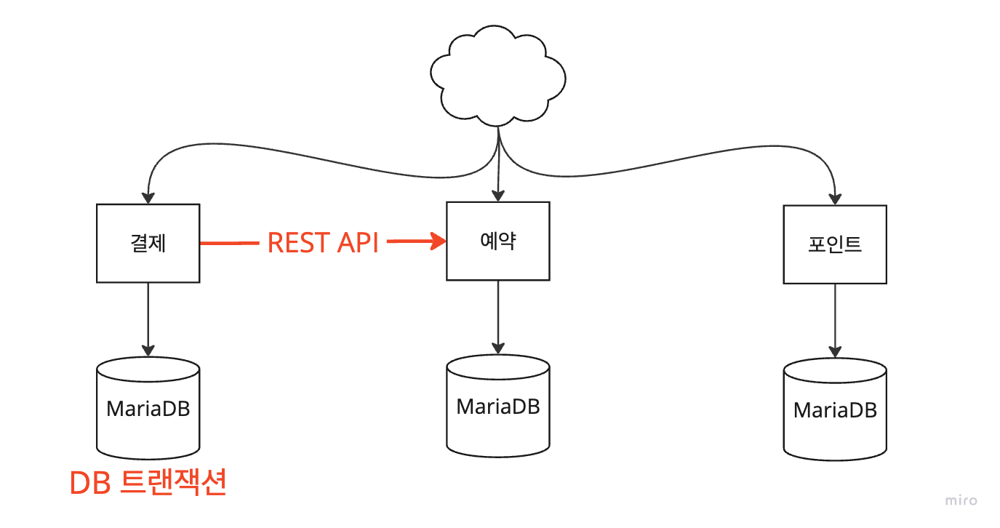
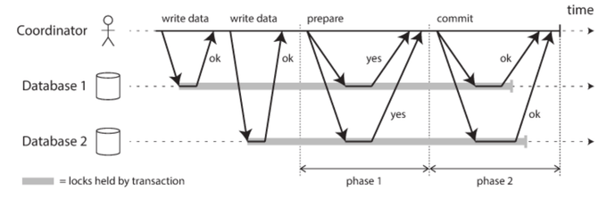
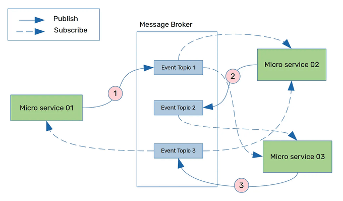
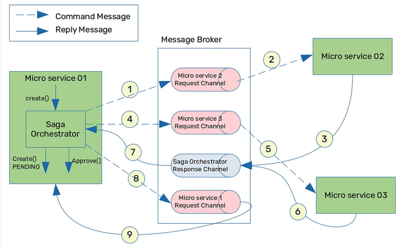

# MSA 전환 설계와 서비스 분리에 따른 트랜잭션 방안

---

# 1. 개요

콘서트 대기열 서비스를 안정적으로 제공하기 위해서는 높은 수준의 동시성 처리와 데이터 무결성을 요구합니다. 

기존 모놀리식 구조에서 마이크로 서비스 아키텍쳐(이하 MSA)으로 전환한다면, 타 서비스에 대한 의존과 영향도를 줄이고 각 서비스에 집중함으로써 강한 응집을 갖는 서비스를 만들 수 있습니다.

하지만, 예약과 결제 일관성을 보장하기 위해서는 포인트, 결제, 예약 도메인 등의 서비스들간의 밀접한 트랜잭션 관리가 필요합니다.

콘서트 대기열 시스템에서의 핵심 기능인 좌석결제에 대해 MSA 전환 설계를 해보고, 이를 위한 트랜잭션 방안에 대해 알아보겠습니다.

# 2. 핵심 기능: 콘서트 좌석 결제

현 시스템에서 콘서트 좌석 예매란, 예약과 결제의 두 가지 기능으로 구성됩니다.

```java
@Transactional
콘서트_좌석_결제() {
    // 1. 예약 정보 조회 및 유효성 검사 - Reservation
    // 2. 포인트 차감 - Point
    // 3. 예약 상태 변경 - Reservation
    // 4. 대기열 토큰 만료 - WaitingQueue
    // 5. 데이터 플랫폼 결제건 전송 - DataPlatformClient
}
```

### 1) 서비스 간 결합도

- 한 메소드에 여러 서비스(Reservation, Point, WaitingQueue, DataPlatformClient)가 밀접하게 연결되어 있습니다.
- 부가로직인 데이터 플랫폼 전송 로직도 섞여 있어 가독성이 떨어집니다.

### 2) 트랜잭션 관리

- 모든 작업이 하나의 트랜잭션으로 이루어집니다.
- 만약, 데이터 플랫폼 전송 이외에도 slack, email 등의 I/O 작업이 추가된다면 트랜잭션이 과도하게 커질 수 있습니다.
- DB 커넥션을 오래 점유하게 되어 DB 장애가 발생할 수 있습니다.

### 3) 모놀리식 구조 문제점

#### 운영 이슈

하나의 서비스가 하나의 DB를 사용하면서 DB 트래픽이 집중되어 장애가 발생할 수 있습니다. 

#### 기술 이슈

서비스 덩어리가 커져 한 가지를 수정하면 사이드 이펙트의 부담이 커집니다.

# 4. MSA 패턴

## 서비스별 데이터베이스 패턴 (Database per Service)

각 서비스별로 독립된 DB를 사용하는 패턴이라고 가정하고, 서비스 간의 트랜잭션을 어떻게 관리할지 알아보겠습니다.



기존 모놀리식 구조에서는 DBMS가 트랜잭션을 관리하여 원자성을 보장했습니다. 트랜잭션의 일부 작업이 실패시 롤백하는 All or Nothing을 DBMS가 안전하게 보장했습니다.

하지만 MSA에서는 전체 트랜잭션이 마이크로 서비스 간에 분산되어 있기 때문에, 일부 서비스가 실패하면 데이터 일관성이 깨지게 됩니다.

## 4.1. 2PC 패턴 (Two-Phase Commit)



2PC는 코디네이터(coordinator)와 여러 리소스(DB)와의 합의를 통해 트랜잭션을 커밋/롤백하는 방식입니다.

### Phase 1. 준비 단계

코디네이터는 모든 리소스에게 커밋 준비를 알립니다. 리소스는 요청을 받고 준비가 완료되면 응답합니다.

### Phase 2. 커밋/롤백 단계

모든 리소스가 준비되면 코디네이터는 글로벌 트랜잭션을 커밋합니다. 만약 어떤 리소스가 준비되지 않았다면, 롤백합니다.

### 문제점

- 트랜잭션의 책임이 코디네이터 노드에게 있어, 단일 실패지점(SPOF)가 될 수 있습니다.
- 전체 트랜잭션이 완료될 때까지 Lock을 걸어야 하기 때문에 성능이 저하될 수 있습니다.
- NoSQL은 2PC 분산 트랜잭션을 지원하지 않습니다.

## 4.2. SAGA 패턴

SAGA 패턴은 MSA 환경에서 완벽한 일관성을 지키기 어렵다는 것을 기반으로, Eventual Consistency(최종적 일관성)을 보장하는 패턴입니다.

여러 개의 개별 서비스의 로컬 트랜잭션이 이어져, 전체 비즈니스 트랜잭션을 구성합니다.
첫번째 로컬 트랜잭션이 완료되면, 두번째 로컬 트랜잭션이 트리거 되고.. 연속된 개별 트랜잭션으로 전체 트랜잭션을 수행합니다.

특정 로컬 트랜잭션이 실패한다면, 이전에 성공한 로컬 트랜잭션들에게 보상 트랜잭션을 발생시켜 이전 상태로 되돌립니다.
DBMS의 롤백과 유사한 개념이지만 데이터 일관성 관리주체가 애플리케이션인 것이 SAGA 패턴의 핵심입니다. 
보상 트랜잭션이 적용되기 전까지 일시적으로 데이터 정합성이 깨질 수 있으나, 보상 트랜잭션이 완료되면 **최종적 일관성**을 보장합니다.

SAGA 패턴은 크게 코레오그래피 기반과 오케스트레이션 기반으로 나뉩니다.

### 1) 코레오그래피 기반 (Choreography-based)



출처: https://medium.com/cloud-native-daily/microservices-patterns-part-04-saga-pattern-a7f85d8d4aa3

코레오그래피 사가는 각 서비스끼리 이벤트를 주고 받는 방식입니다.

각 서비스가 다른 서비스의 로컬 트랜잭션을 이벤트 트리거하는 방식으로 이루어집니다. 만약 다음에 수행되어야 할 트랜잭션이 있다면, 해당 이벤트를 구독한 서비스가 이어서 실행합니다.
중간에 트랜잭션이 실패하면, 이에 대한 보상 트랜잭션 이벤트를 발생시켜 롤백을 시도합니다.

#### 장점

- 중앙 관리형이 아니기 때문에, SPOF가 없습니다. 즉, 하나의 서비스에 문제가 발생해도 다른 서비스에 영향이 적습니다.

#### 단점

- 서비스끼리 이벤트를 주고 받기 때문에, 트랜잭션 흐름이 복잡해지면 구조를 파악하기 어렵습니다.
- 서비스간 순환 종속이 발생할 수 있습니다. 

### 2) 오케스트레이션 기반 (Orchestration-based)



출처: https://medium.com/cloud-native-daily/microservices-patterns-part-04-saga-pattern-a7f85d8d4aa3

오케스트레이션 사가는 중앙 집중형으로 트랜잭션 실행 흐름을 관리하게 됩니다.

중앙의 오케스트레이터가 각 서비스들에게 트랜잭션을 실행해야 하는지 알려주는 방식입니다. 오케스트레이터가 모든 트랜잭션과 보상 트랜잭션을 관리합니다.

#### 장점

- 트랜잭션 흐름을 중앙에서 관리하기 때문에, 트랜잭션 흐름을 명확히 파악할 수 있습니다.
- 각 서비스는 서로를 알지 못하여 결합도가 낮습니다.

#### 단점

- 오케스트레이터에 중앙 집중되어 SPOF가 될 수 있습니다.

# 5. MSA 전환 설계

현 시스템에서 트랜잭션 흐름이 과도하게 복잡한 부분이 없기 때문에, 오케스트레이션 기반의 SAGA 패턴을 적용해보겠습니다.

## 5.1. RDB를 사용하는 애플리케이션 이벤트 전달

### 5.1.1. 트랜잭션 이벤트와 Retry 활용

```java
@Service
public class PointService {
    
    @Transactional
    public PointInfo usePoint(PointUseCommand command) {
        Point point = pointRepository.findByUserIdWithLock(command.userId());
        point.usePoint(amount);
        
        pointRepository.save(point);
        applicationEventPublisher.publishEvent(PaymentEvent.of(command)); // 트랜잭션 이벤트 발행
        
        return PointInfo.fromEntity(point);
    }
}
```

```java
@Component
public class PaymentEventListener {

    @Retryable(maxAttempts = 3, backoff = @Backoff(delay = 1000))
    @TransactionalEventListener(phase = TransactionPhase.AFTER_COMMIT)
    public void handlePointUseEvent(PointUseEvent event) {
        // + restTemplate.execute(event) // REST API를 이용해 이벤트 전달
    }
}
```

### 장점

- 트랜잭션 이벤트 리스너를 통해, 간단하게 이벤트를 전달할 수 있습니다.

### 단점

- 재시도 3번이 모두 실패하면, 기존 트랜잭션만 커밋되고 하위 트랜잭션이 실행되지 않아 데이터 일관성이 깨집니다.
- 네트워크 장애 등의 이유로 이벤트 전달에 실패하면, 해당 이벤트는 손실됩니다.

### 5.1.2. Transactional Outbox 패턴 & Polling Publisher 패턴

Transactional Outbox 패턴은 RDB를 Message Queue로 사용하여 이벤트를 저장하는 방식입니다.

Polling Publisher 패턴은 주기적으로 RDB에 저장된 이벤트를 조회하여 처리하는 방식입니다.

두 가지 패턴을 조합하면 REST API 환경에서도 글로벌 트랜잭션을 안전하게 보장할 수 있습니다.

```java
@Service
public class PointService {
    
    @Transactional
    public PointInfo usePoint(PointUseCommand command) {
        Point point = pointRepository.findByUserIdWithLock(command.userId());
        point.usePoint(amount);
        
        pointRepository.save(point);
        eventRepository.save(PointUseEvent.of(command)); // DB에 이벤트 저장
        
        return PointInfo.fromEntity(point);
    }
}
```

```java
@Component
public class MessagePublisher {

    @Scheduled(cron = "0/5 * * * * *")
    @Transactional
    public void publish() {
        LocalDateTime now = LocalDateTime.now();
        eventRepository.findByCreatedAtBefore(now, EventStatus.READY)
                .stream()
                .map(event -> restTemplate.execute(event)) // REST API를 이용해 이벤트 전달
                .map(event -> event.done())
                .forEach(eventRepository::save);
    }
}
```

### 장점

- REST API 환경에서 트랜잭션을 안전하게 보장할 수 있습니다.

### 단점

- Polling, Publisher 과정으로 인한 지연이 발생합니다.
- DB에 이벤트를 모두 저장하기 때문에 부하가 발생할 수 있습니다.

## 5.2. Kafka를 사용하는 애플리케이션 이벤트 전달

### Producer Confirm

Producer Confirm은 프로듀서가 메시지 전송 성공 여부를 확인하는 방식입니다.

```java
@Component
public class Producer {
    public void sendEvent(PointUseEvent event) {
        ListenableFuture<SendResult<String, PointUseEvent>> future =
                kafkaTemplate.send(POINT_USE_EVENT_TOPIC, event);
        future.addCallback(
                result -> log.info("offset: {}", result.getRecordMetadata().offset()),
                throwable -> log.error("fail to publish", throwable)
        );
    }
}
```

### Consumer Ack

Consumer Ack은 컨슈머가 메시지를 성공적으로 받았음을 프로듀서에게 알리는 방식입니다.

명시적으로 `acknowledge()` 메소드를 호출하여 오프셋을 커밋하여 메시지를 처리했음을 알립니다. (수동 커밋)

```java
@FunctionalInterface
public interface AcknowledgingMessageListener<K, V> extends MessageListener<K, V> {
    default void onMessage(ConsumerRecord<K, V> data) {
        throw new UnsupportedOperationException("Consumer should never call this method");
    }
    
    void onMessage(ConsumerRecord<K, V> data, Acknowledgment acknowledgment);
}
```

```java
@Override
@KafkaListener(
        //..
        containerFactory = "kafkaListenerContainerFactory"
)
public void onMessage(ConsumerRecord<String, PointUseEvent> data, Acknowledgment acknowledgment) {
    try {
        //..
        acknowledgment.acknowledge(); // 성공한 Consumer Ack 전송
    } catch (Exception e) {
        log.error("fail to process", e);
    }
}
```

```java
@Bean
public ConsumerFactory<String, String> consumerFactory() {
    Map<String, Object> props = new HashMap<>();
    //..
    props.put(ConsumerConfig.ENABLE_AUTO_COMMIT_CONFIG, "false");
    //..
    return new DefaultKafkaConsumerFactory<>(props);
}
```

## Reference

- 데보션 기술블로그 [[MSA 패턴] SAGA, Transactional Outbox 패턴 활용하기](https://devocean.sk.com/blog/techBoardDetail.do?ID=165445)
- 우아한 기술블로그 [회원시스템 이벤트기반 아키텍처 구축하기](https://techblog.woowahan.com/7835/)
- 카카오페이 기술블로그 [MSA 환경에서 네트워크 예외를 잘 다루는 방법](https://tech.kakaopay.com/post/msa-transaction/)
- 카카오 기술블로그 [이모티콘 서비스는 왜 MSA를 선택했나?](https://tech.kakao.com/posts/457)
- [SAGA 패턴을 통해 MSA에서의 데이터 일관성 보장하기](https://hudi.blog/saga-pattern/)
- NHN Cloud 유튜브 [[NHN FORWARD 22] 분산 시스템에서 데이터를 전달하는 효율적인 방법](https://www.youtube.com/watch?v=uk5fRLUsBfk)
- 